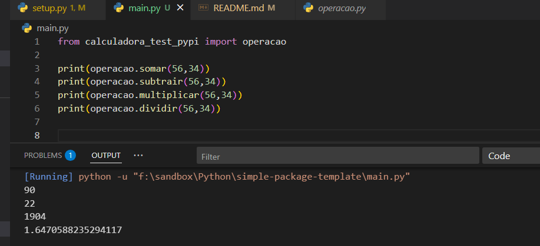
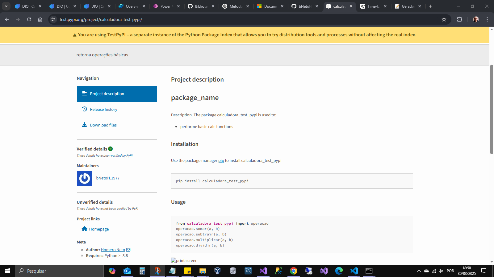

# package_name

Description.
The package calculadora_test_pypi is used to:

- performe basic calc functions

## Installation

Use the package manager [pip](https://pip.pypa.io/en/stable/) to install calculadora_test_pypi

```bash
pip install calculadora_test_pypi
```

## Usage

```python
from calculadora_test_pypi import operacao
operacao.somar(a, b)
operacao.subtrair(a, b)
operacao.multiplicar(a, b)
operacao.dividir(a, b)
```





## Author

Homero Barbosa

## License

[MIT](https://choosealicense.com/licenses/mit/)
